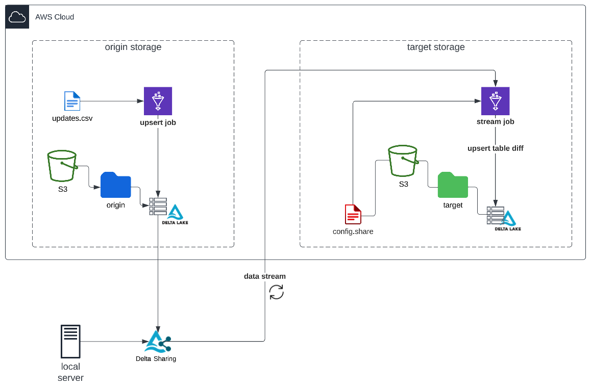

# delta-share-stream-example



## Configurar Serviço Delta Sharing Local

- Instalar o servidor Delta Sharing localmente utilizando o pré built package conforme [instruções no github do projeto](https://github.com/delta-io/delta-sharing#delta-sharing-reference-server).

- Copiar o arquivo `delta-sharing-server/delta-sharing-server.yaml` para a pasta `conf` do servidor

- Configurar esse arquivo para compartilhamento da tabela (instruções no arquivo)

- Iniciar o serviço executando:
    
    ```bin/delta-sharing-server -- --config conf/delta-sharing-server.yaml```
    
- Para acesso ao serviço delta sharing (local) via Glue (cloud) é preciso expor seu endpoint para internet. Para esse exemplo foi utilizado o serviço [https://localhost.run](https://localhost.run/docs/).

- Executar o seguinte comando para expor o serviço
    
    `ssh -R 80:localhost:8080 plan@localhost.run`

- Inserir o endpoint fornecido na console para o arquivo `delta-sharing-server/config.share`

- Esse arquivo contêm as credenciais para acesso ao serviço Delta Share e deve ser salvo em um bucket S3. O path para esse arquivo deve ser configurado na variável `origin_delta_share_path` do job `glue/stream.py`  


## Criar jobs Glue

- Criar job Glue init_tables utilizando o script `glue/init_tables.py`
    - Type: Spark

- Criar job Glue upsert utilizando o script `glue/upsert.py`
    - Type: Spark

- Criar job Glue stream utilizando o script `glue/stream.py`
     - Type: Spark Streaming
     - Salvar o arquivo `delta-sharing-client/jar/delta-sharing-spark_2.12-0.6.3.jar` em um bucket S3
     - Na guia `job details`, incluir path para esse arquivo no campo `Dependent JARs path`

- Para todos os jobs Glue, na guia `Job details` configurar a versão `glue 4.0` e adicionar os `Job parameters` a seguir:

    `--conf` :
    ```
    spark.sql.extensions=io.delta.sql.DeltaSparkSessionExtension --conf spark.sql.catalog.spark_catalog=org.apache.spark.sql.delta.catalog.DeltaCatalog`
    ```

    `--datalake-formats` : 
    ```
    delta
    ```

Referência: [https://docs.aws.amazon.com/glue/latest/dg/aws-glue-programming-etl-format-delta-lake.html](https://docs.aws.amazon.com/glue/latest/dg/aws-glue-programming-etl-format-delta-lake.html)


## Execução

- Salvar os arquivos da pasta `sample-data/` em um bucket

    `fruits.csv` : contêm os dados para o job `init_tables.py` criar e inicializar as tabelas

    `fruits_batch.csv` : contêm os dados para atualização da origem pelo job `upsert.py`


- Configurar os jobs com paths para arquivos de origem e destino

- Executar job `init_tables.py`

- Executar job `stream.py`

- Executar job `upsert.py`

- Alterar o arquivo `fruits_batch.csv` e reexecutar o job `upsert.py` para inserir novas atualizações no fluxo

- Para visualizar os dados criar um Glue Crawler do tipo Delta Table tendo como origem o path da tabela target. Consultar dados via AWS Athena.


## Referências

[https://docs.delta.io/latest/delta-streaming.html#](https://docs.delta.io/latest/delta-streaming.html#)

[https://docs.delta.io/latest/delta-update.html#upsert-from-streaming-queries-using-foreachbatch](https://docs.delta.io/latest/delta-update.html#upsert-from-streaming-queries-using-foreachbatch)

[https://docs.delta.io/latest/delta-change-data-feed.html#enable-change-data-feed](https://docs.delta.io/latest/delta-change-data-feed.html#enable-change-data-feed)
